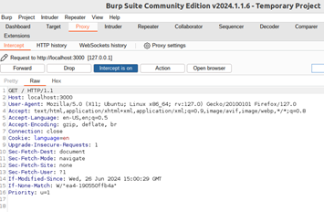
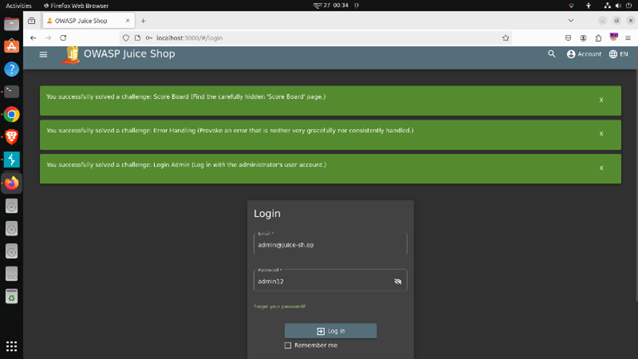
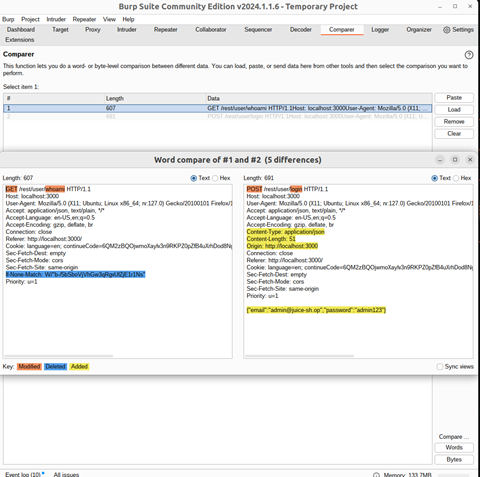

# Beginner Burp Suite Community Edition Tutorial
## Introduction
### Burp Suite Community Edition

Burp suite is essentially an integrated platform for performing security testing of web applications. In Burp Suite the first thing, we need to understand is that it will allow us to intercept the data being sent between our browser and the web application. So, it's a great way of understanding how data is being transferred, and how data can be manipulated, between the client and the web application.  

### Lab Setup

To use the burp suite, we use the OWASP Juice Shop & Vulnweb.com for our web Pentesting. By doing web pentesting, we look for different features of Burp Suite and see which features what need to do.   

In the beginning, we added an extension in Mozilla, froxyproxy that allows us to do manual configuration and attack only a single target. So, from extension store, first add the froxy proxy (fig: 0.1). After that we configure it. We add an IP address where our target will be situated.  

  
*Fig: 0.1*  

Using the docker, we install the OWASP Juice Shop into localhost 3000. From here we start the use of burp Suite.  
Here we will try SQL injection and other login methods. 

## Proxy

It’s a feature of burp suite. Here belongs an option Intercept. By clicking the Intercept is On and then refresh the localhost, the local host do not take load and there is something showed in intercept just like the fig 1.1.
Here Intercept basically intercepts the request from user to the server and shows what is going on in the backend of the request. In this data, there are host, user-agent, cookie and many things. It’s a normal request. But in future when we do work on other fields on that website, we can explore our request which may give some vulnerable information by which we can attack on that website.    

  
*Fig: 1.1*  

By clicking on Forward, it shows the data is changed (fig: 1.2). It basically goes through one-by-one request to server to take full load of this website.  
  
*Fig: 1.2*  

## Repeater

Repeater is allowed to repeat the request. If we want to be tempering the parameters or want to test something but don’t want to show it on a website, we use this feature. The requests parameter that we got in Intercept, we forward it to Repeater and then in repeater Request part(fig:2.1), we edit the parameters.    

  
*Fig: 2.1*  

So that we can check in response (fig:2.2) what happened if we change the parameter. We can do malicious activity and can check if this successful or not before we are do it to the real server.   
  
*Fig: 2.2*  

Now come to a real example: **SQL Injection**  

We have this parameter (fig:2.3) and as it is SQL injection, we will try different email and password. So, before we enter the email and password, we try it on repeater and check what response it gives.  
  
*Fig:2.3*  

Change the email: test’, now let’s check what happened. It shows SQL error with command and others (fig: 2.4). So, let’s do malicious activity. We give something in return True.   

  
*Fig: 2.4*  

By changing the parameter, we login as an admin user on the website. So, we do all SQL injections in repeater section (fig: 2.5) and ensure that which one works, and after that we enter the site.    

  
*Fig: 2.5*  

## Intruder

In the intruder, we store the payload which is used for intruder attack. When we try to input anything input any website, for example in login we want to test the username and password, this module is used there. We will bypass authentication by using this. In this module, there are four types of attack (fig: 3.1). These attacks have different roles. We will follow different methods to do the bypass. One method shows in Decoder by SQL injection. Here we will use Intruder.  

  
*Fig: 3.1*  

### Sniper:

We use this for Sigle-position attacks. When we have a wordlist of different combinations, we use this Sniper.							             

For example, in login panel there is an option for username and password. And we have a list of different common usernames and passwords. The sniper attack takes the word and used those in username first and after that it used in password. So, if we know the username, we can make a password word list and do the brute force attack.   

  
*Fig: 3.2*  

For real example, I create a word list of passwords. I know the mail and now taste it (fig 3.2). We start the attack by giving the real email and trying different password. So, it gives output of authentication in real password (fig: 3.3).  

  
*Fig: 3.3*  

### Battering Ram: 

This attack is similar to a Sniper, but it takes two inputs at the same time. When the username and the password are the same, we can perform this attack. It takes words from the wordlist and uses the same word both in username and password and does the brute force attack. 

### Pitchfork:

Here we get two payloads. It means we can use 2 wordlists. So, we can use one wordlist for username and another wordlist for password. This attack takes those line by line and uses the brute force attack. 

  
*Fig: 3.4*  

### Cluster Bomb:  

In this attack, we also get 2 payloads. In this attack, the wordlist get freeze. For example, we have word lists of usernames and passwords. 

  
*Fig: 3.5*  

So, it takes the first input from the username list and freezes it. In password part, it tries all the password in the list on that first username that exist in username list. If it does not find a match, then it goes for the second word in username and again try all the password and go on until it gets result or finish the list.

## Decoder

In the burp suit intercept texts, sometimes we find different hash values of different items. To understand the hash values, we used Decoder. It decodes the hash in many different modes.  

For the real example: SQL injection  

  
*Fig: 4.1*  

After successfully login in the admin panel, we can see there is something hash (fig: 2.5) in token variable. There may be some valuable information for us to gather in case of further attacks. To decode it send to decoder and as it is bash64 hash. We decoded it on base 64 and we got some valuable information (fig 4.1) where we got the admin mail and admin password in another hash. In repeater, we do SQL injection, so we don’t know the mail nor the password. But now we know the mail and the password and many more details of this account.   

  
*Fig: 4.2*  

All these things are only shown in this decoder option. If we want to see the decode of password hash, we just copy paste it. So again, the decoder can give us the password (fig: 4.2). We get the password hash and by analyzing it we get it hashed by MD5 and we decrypt it. From next time, we don’t need the SQL injection, we can directly enter in the admin panel as we have mail and password and login successfully (fig: 4.3 & 4.4). 

  
*Fig: 4.3*  

  
*Fig: 4.4*  

## Sequencer

When we try to login into a website with our username and password, the website sends the username and password to their database and tries to match it with the database. After that they return a session id which works as a key to enter user account. But if we can generate the session id by ourselves, it becomes vulnerability.  

  
*Fig: 5.1* 

Sequencer is a module where we can send the intercept request from a proxy to sequencer without the session id. The sequencer generates many sessions id and we analyze whether the session id can be guessed or not. Sequencer try to find out is there any pattern in the session id or not. If there is pattern found, then sequencer gives an overall result poor or if it can’t be guessed so the sequencer gives the result excellent.  

  
*Fig: 5.2*  

Let’s do a practical test. We used the vulnweb.com website and tried to login there. First, we start the intercept on and take the intercept information and remove the session id (fig: 5.1). After that we send it to sequencer and analyze it. In the summary (fig: 5.4) it gives result that the session id is very good. It means the randomness is very much here. If it gives poor, it means we can guess the session id and analyze it. At that time, the crypto knowledge

  
*Fig: 5.3*  

  
*Fig: 5.4*   

## Comparer

Comparer is a module where we compare HTTP requests and responses. We can compare between two items here. After doing malicious something, we can see what changed before and after the attack on the web page. We can check the difference when we try to login with valid information and invalid information (fig: 6.1). These things give more information about where we can find anything vulnerable. 

  
*Fig: 6.1*   

Here we can see the modified, deleted and added items and compare them to get information.

## Extension

In Burp Suite Community Edition, there are many facilities that are not preinstalled. Using the extension module (fig 7.1), we can install and use it for our work purposes. In fig 7.1, we can see there is no extension installed, on the right site we can see the list of extensions and in bottom box, we can see its details. 

  
*Fig: 7.1*  

In BApp Store (fig: 7.2), from here we can install the extension we want.  Here we search on the search bar and then install it.  

  
*Fig: 7.2*  

Lastly the APIs part(fig:7.3), here we can see the endpoints of every extension and write there in our favor. We can change the Api as we want it can be written in Java, Python via Jython or Ruby via JRuby. Using these language, we can change API and use the extension as we want.

  
*Fig: 7.3*   

This is a brief of many module in Burp Suite Community Edition. There are many things more and it can be describe more elaborately. 
